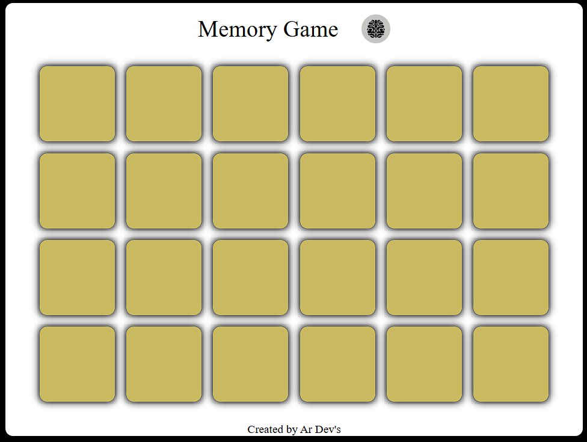

# Memory Game - React.js

A simple and fun **Memory Game** built using **React.js**, where players try to match pairs of cards by flipping them over.

## 🎮 Game Overview
The game consists of a grid of cards, all initially face down.  
- Players can click on two cards to flip them.  
- If the two cards match, they remain face up.  
- If they do not match, they flip back after a short delay.  

## 🛠 Features
- Responsive design for desktop and mobile screens.  
- Randomized card positions on each game start.  
- Smooth card flipping animation using React state.  
- Easy to extend with more cards or themes.  

## 📦 Installation
1. Clone the repository:
   ```bash
   git clone https://github.com/alisraza123/Memory-Game.git
Navigate to the project folder:

cd memory-game

Install dependencies:

npm install

Start the development server:

npm start

Open http://localhost:5173
 in your browser.

⚡ Technologies Used

React.js - Frontend library

CSS - Styling and animations

Optional: React Hooks for state management

📸 Screenshots



📂 Project Structure
memory-game/
│
├── public/
│   └── index.html
├── src/
│   ├── components/  # Card and game components
│   ├── assets/      # Images for cards
│   ├── App.js       # Main app
│   └── index.js     # Entry point
└── package.json
📝 How to Play

Click on a card to show.

Click another card to try to match it.

If the cards match, they stay visible.

If not, they hide back after a short delay.

Repeat until all pairs are matched!

🚀 Future Enhancements

Add difficulty levels (easy, medium, hard).

Add a timer and leaderboard.

Add card themes and sounds.

📄 License

This project is open-source and free to use.
